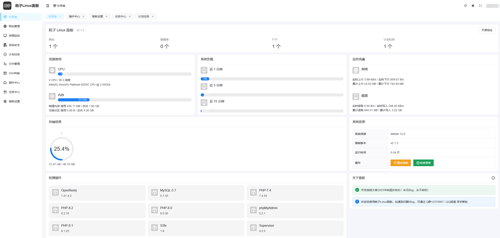

<h1 align="center">HaoZi Linux Panel</h1>

<p align="center">
  <a href="https://github.com/haozi-team/panel/releases"></a>
  <a href="https://github.com/haozi-team/panel/actions"></a>
  <a href="https://goreportcard.com/report/github.com/haozi-team/panel"></a>
  <a href="https://codecov.io/gh/haozi-team/panel"></a>
  <a href="https://img.shields.io/github/license/haozi-team/panel"></a>
</p>

<p align="center">
[<a href="README.md">简体中文</a>] | [English]
</p>

The HaoZi Linux Panel is a lightweight Linux server operation and maintenance management panel developed using Golang for our own business needs. It is open source under the Apache 2.0 protocol.

Disclaimer: It is strictly prohibited to use the HaoZi Linux Panel to engage in any illegal activities. Please do not request any form of technical support from us for illegal sites. If illegal content is discovered during the technical support process, we will immediately stop technical support and retain relevant evidence.

Communication QQ group: [12370907](https://jq.qq.com/?_wv=1027&k=I1oJKSTH) | QQ channel: [pd.qq.com/s/fyol46wfy](https://pd.qq.com/s/fyol46wfy)

## UI Screenshots



## Operating Environment

HaoZi Linux Panel only supports the latest version of mainstream systems under the `amd64` | `arm64` architecture. It does not support `Ubuntu` because its releases are too frequent and difficult to maintain.

Recommended to use `Debian` for low-configuration machines, as its resource usage is lower than that of the `RHEL` system. For other machines, recommended to use `RockyLinux` | `AlmaLinux`, which has a longer maintenance cycle and is more stable.

For other systems not in the table below (OpenCloudOS 8, Anolis 8, CentOS Stream 8/9, Debian 11, etc.), you can try to install it yourself, but normal operation is not guaranteed, and free technical support is not provided (theoretically there will be no major question).

CentOS Stream can be migrated to a supported system using the migration script: [CentOS 8/9 Migration Script](https://github.com/haozi-team/byecentos)

| OS         | Version |
|------------|---------|
| RHEL       | 9       |
| RockyLinux | 9       |
| AlmaLinux  | 9       |
| Debian     | 12      |

As system versions are constantly updated, we may also terminate support for some older systems to ensure the stability of the panel.

## Install Panel

Before installing the panel, you need to understand the basic knowledge of the LNMP environment and how to deal with common LNMP environment problems. It is not recommended for users with zero basic knowledge to install and use HaoZi Linux Panel ([Recommended: aaPanel - easy-to-use server operation and maintenance panel](https://aapanel.com)).

If you decide to continue, please log in to the server as `root` user and execute the following command to install the panel:

```shell
bash <(curl -sSL https://jihulab.com/haozi-team/download/-/raw/main/panel/install_panel.sh)
```

## Uninstall Panel

Recommended to back up data and reinstall the system first, so that the system can be kept clean.

If you are unable to reinstall the system, log in to the server as the `root` user and execute the following command to uninstall the panel:

```shell
bash <(curl -sSL https://jihulab.com/haozi-team/download/-/raw/main/panel/uninstall_panel.sh)
```

Before uninstalling the panel, please be sure to back up all data and uninstall all panel plugins in advance. The data will **not be recoverable** after uninstallation!

## Daily Maintenance

Use `panel` command for daily maintenance:

```shell
panel
```

See more usage methods and tips in [Wiki](https://github.com/haozi-team/panel/wiki).

## Feedback

For usage issues, you can ask questions in the [WePublish Community Forum](https://wepublish.cn/forums) or seek AI help in the QQ group `@坤坤`. You can also seek paid support in the group.

For issues with the panel itself, you can submit feedback on the `Issues` page of GitHub. Please note [the wisdom of asking questions](http://www.catb.org/~esr/faqs/smart-questions.html).

## Contribute code

### Find/Create Issue

You can find or create an Issue in [Issue List](https://github.com/haozi-team/panel/issues), leave a message to express your willingness to deal with the Issue, and get confirmation from the maintainer. Start processing.

### Create PR

- During the development process, if you encounter a problem, you can describe the problem in detail in the Issue at any time for further communication, but before doing so, please make sure that you have tried your best to solve the problem through Google and other methods;
- PRs must be submitted to our JiHu GitLab repository [https://jihulab.com/haozi-team/panel](https://jihulab.com/haozi-team/panel). Do not submit on GitHub;
- When the PR is completed, please add the `🚀 Review Ready` tag to it, and the maintainer will review it in time;
- We very much welcome your contributions and will add you to the homepage contributors in the next release; ❤️

## Sponsor

### Server

- [盾云](https://www.ddunyun.com/aff/PNYAXMKI)

### CDN

- [无畏云加速](https://su.sctes.com/register?code=8st689ujpmm2p)

- [又拍云](https://www.upyun.com/?utm_source=lianmeng&utm_medium=referral)

- [AnyCast.Ai](https://www.anycast.ai/)

- [盾云CDN](http://cdn.ddunyun.com/)

### Object Storage

- [又拍云](https://www.upyun.com/?utm_source=lianmeng&utm_medium=referral)

### DevOps

- [JiHu GitLab](https://www.jihulab.com/)

**Accept cloud resources and financial sponsorship, you can contact us through QQ group**

## Contributor

This project owes its existence to all those who have contributed. To contribute, please check the contributed code section first.

<a href="https://github.com/DevHaoZi" target="_blank"></a>

## Star History

<a href="https://star-history.com/#haozi-team/panel&Date">
  <picture>
    <source media="(prefers-color-scheme: dark)" srcset="https://api.star-history.com/svg?repos=haozi-team/panel&type=Date&theme=dark" />
    <source media="(prefers-color-scheme: light)" srcset="https://api.star-history.com/svg?repos=haozi-team/panel&type=Date" />
    
  </picture>
</a>
